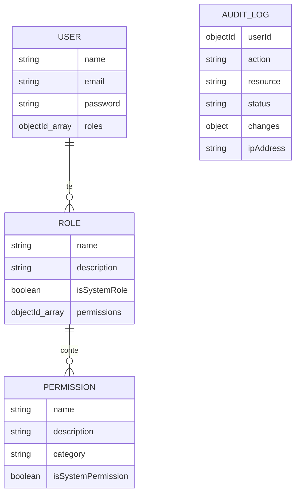

# Sistema Avançat de Rols i Permisos (RBAC) amb Auditoria

Projecte realitzat per a la **Tasca 8** del mòdul de Frameworks de frontend i backend.

## 🚀 Descripció

Aquesta API escrita en Node.js implementa un control d'accés basat en rols (RBAC) d'alt nivell. Permet gestionar permisos granulars, agrupar-los en rols i assignar-los a usuaris, tot sota un sistema de monitorització d'auditoria automàtica.

## 🛠️ Tecnologies

- **Runtime:** Node.js
- **Framework:** Express.js
- **Base de dades:** MongoDB + Mongoose
- **Seguretat:** JWT (JSON Web Tokens) & Bcryptjs
- **Validació:** Express-validator

## 🔑 Característiques Principals

- **Seguretat Granular:** Els permisos es defineixen acció per acció (ex: `tasks:create`).
- **Auditoria Automàtica:** Es registren totes les accions administratives, incloent IP, User-Agent i canvis realitzats.
- **Protecció de Sistema:** Bloqueig d'eliminació per a rols i permisos crítics.
- **Seeding Automàtic:** Script per inicialitzar la base de dades amb una arquitectura de seguretat funcional.

## 📊 Sistema de Permisos i Relacions

El sistema utilitza una jerarquia de tres nivells per gestionar l'accés:

1. **Permisos:** Accions atòmiques (ex: `users:read`, `tasks:delete`).
2. **Rols:** Grups de permisos (ex: l'usuari "admin" té tots els permisos).
3. **Usuaris:** Poden tenir un o més rols assignats.

### Diagrama de Relacions (ER)



## 🚦 Instal·lació i Ús (Setup)

1. **Clonar el repositori:**

   ```bash
   git clone https://github.com/jasonokoro10/rols_permisos_node.git
   cd rols_permisos_node
   ```

2. **Instal·lar dependències:**

   ```bash
   npm install
   ```

3. **Configurar variables d'entorn (.env):**
   Crea un fitxer `.env` a la arrel amb:

   ```env
   PORT=3000
   MONGODB_URI=mongodb://localhost:27017/tasca8_rbac
   JWT_SECRET=la_teva_clau_secreta
   JWT_EXPIRE=30d
   ```

4. **Inicialitzar la base de dades (Seeding):**
   Aquest pas crea els permisos, rols i l'usuari admin inicial.

   ```bash
   npm run seed:rbac
   ```

5. **Executar el servidor:**
   ```bash
   npm run dev
   ```

## 🧪 Exemples d'ús (Endpoints)

### Autenticació

- **POST** `/api/auth/login`: Obté el token JWT.
- **POST** `/api/auth/check-permission`: Verifica si el token actual té un permís.

### Administració (Requereix Admin)

- **GET** `/api/admin/users`: Llista d'usuaris.
- **GET** `/api/admin/roles`: Llista de rols.
- **GET** `/api/admin/audit`: Logs d'auditoria.
- **GET** `/api/admin/audit/stats`: Estadístiques d'ús.

## ⚠️ Casos d'Error Documentats

| Codi | Error             | Descripció                                                           |
| ---- | ----------------- | -------------------------------------------------------------------- |
| 401  | No autenticat     | El token falta o ha caducat.                                         |
| 403  | Forbidden         | L'usuari no té el permís necessari per a l'acció.                    |
| 403  | Sistema Protegit  | Intent d'eliminar un rol o permís de sistema (`isSystemRole: true`). |
| 400  | Validació fallida | El format del permís no és `recurso:accion` o falten camps.          |
| 404  | No trobat         | El recurs (ID) no existeix a la base de dades.                       |

## 🧪 Usuari Administrador Inicial

- **Email:** `admin@test.com`
- **Password:** `Password123!`

---

Realitzat per **Jason Okoro** - 2026
